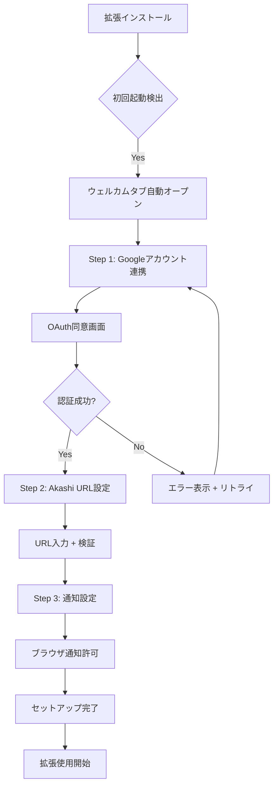
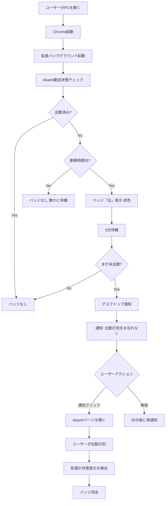
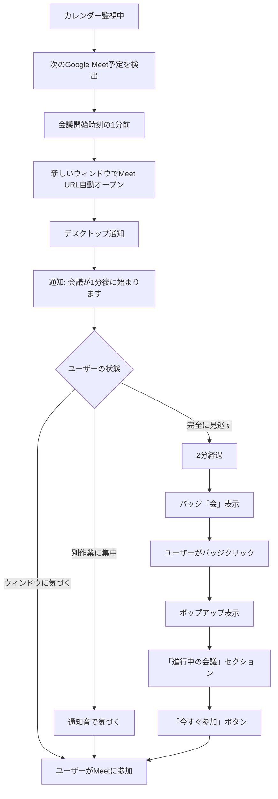
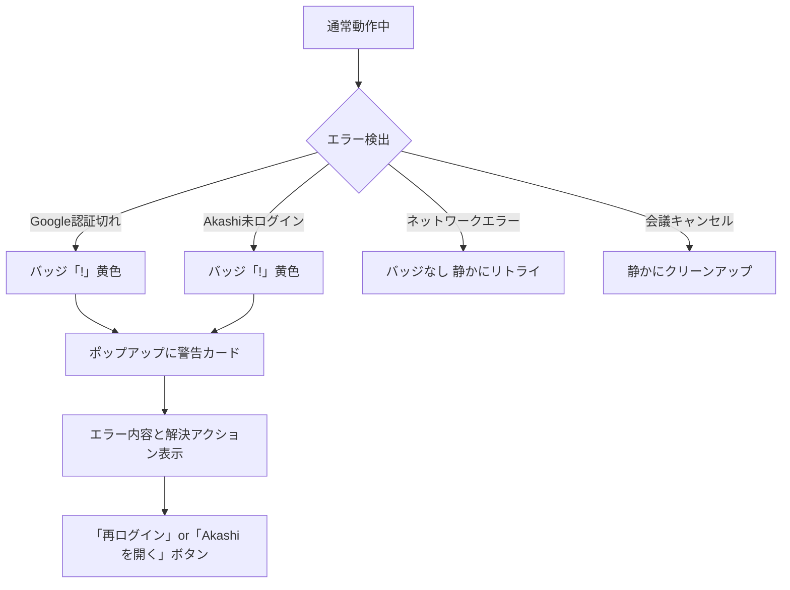

# Meet Akashi Launcher - UXフロー設計書

## 1. 概要

**Meet Akashi Launcher**は、Google MeetとAkashi勤怠管理を統合し、リモートワーカーの日常業務を自動化するChrome拡張機能です。

### コアバリュー
- **邪魔にならない自動化**: ユーザーの作業フローを遮断せず、必要な時だけ適切なタイミングで介入
- **認知負荷の軽減**: 出勤忘れ、会議遅刻を防ぐパッシブなリマインド
- **ワンアクションの原則**: すべての操作は1クリック以内で完結

---

## 2. UX原則

### パッシブファースト、アクティブはラスト
- デフォルトは静かに動作（バッジ表示のみ）
- 通知は必要最小限（出勤忘れ、会議直前のみ）
- ポップアップは能動的に開いた時のみ表示

### 文脈に応じた情報量
- **バッジ**: 1文字（「出」）
- **通知**: 1行（「出勤打刻をしてください」）
- **ポップアップ**: 必要な情報と次のアクション

### 段階的開示（Progressive Disclosure）
- 初回セットアップは最小限の情報から
- 高度な設定は使い慣れてから

---

## 3. ペルソナ

### プライマリーペルソナ: 田中健太（29歳、Webエンジニア）
- リモートワーク中心、1日3〜5件のオンライン会議
- 集中すると時間を忘れる
- 出勤打刻を忘れがち（月2〜3回）

### セカンダリーペルソナ: 佐藤美咲（34歳、プロジェクトマネージャー）
- 1日8〜10件の会議、バックトゥバック
- 複数のタブとアプリを同時使用
- 会議開始時刻ギリギリまで作業

---

## 4. ユーザーフロー

### フロー1: 初回セットアップ



#### UX詳細

**ウェルカム画面**
- ヘッドライン: 「Meet Akashi Launcherへようこそ」
- サブヘッド: 「出勤忘れと会議遅刻を防ぐアシスタント」
- 3ステップで完了する旨を表示

**Step 1: Googleアカウント連携**
- 説明: 「カレンダーから次の会議を自動検出します」
- 権限説明: 「カレンダーの読み取りのみ（書き込みはしません）」

**Step 2: Akashi URL設定**
- プレースホルダー: `https://example.atnd.ak4.jp`
- リアルタイムURL形式チェック
- ヘルプリンク: 「Akashi URLの見つけ方」

**Step 3: 通知設定**
- スキップ可能（後で設定ページから有効化可能）
- 完了画面でアニメーション表示

---

### フロー2: 毎朝のルーティン



#### バッジ表示ルール

| 状態 | 表示 | 背景色 | 意味 |
|------|------|--------|------|
| 未出勤 | 「出」 | 赤 #DC2626 | 出勤打刻が必要 |
| 進行中会議 | 「会」 | 青 #2563EB | 見逃した会議がある |
| エラー | 「!」 | 黄色 #FBBF24 | 設定や認証の問題 |
| 正常 | なし | - | すべて正常 |

#### 通知タイミング戦略
1. 勤務開始時刻（デフォルト9:00）から5分後
2. その後30分ごと（最大3回まで）
3. ユーザーが出勤したら即座に停止

---

### フロー3: 会議参加フロー



#### 自動オープンの挙動
- **タイミング**: 会議開始1分前（設定で変更可能: 30秒〜5分前）
- **ウィンドウ**: 新しいウィンドウ（既存タブを汚染しない）
- **フォーカス**: 自動でフォーカス
- **サイズ**: デフォルト

---

### フロー4: エラー・エッジケース



#### エラーメッセージ設計

**Google認証切れ**
- タイトル: 「カレンダーに接続できません」
- 説明: 「Googleアカウントの認証が期限切れです」
- アクション: 「再ログイン」ボタン

**Akashi未ログイン**
- タイトル: 「Akashiに接続できません」
- 説明: 「ブラウザでAkashiにログインしてください」
- アクション: 「Akashiを開く」ボタン

**ネットワークエラー**
- 通知は出さない（静かにリトライ）
- ポップアップにのみ表示

---

## 5. UIコンポーネント設計

### ポップアップ（360px × 500px）

```
┌─────────────────────────────┐
│ Header                      │
│  [Logo] Meet Akashi Launcher │
├─────────────────────────────┤
│ Status Card                 │
│  ✓ 出勤済み 09:15          │
│  📅 次の会議: 10:00        │
├─────────────────────────────┤
│ Upcoming Meetings           │
│  ┌───────────────────────┐ │
│  │ 10:00 チームMTG       │ │
│  │ [参加する]            │ │
│  └───────────────────────┘ │
│  ┌───────────────────────┐ │
│  │ 14:00 1on1            │ │
│  │ [参加する]            │ │
│  └───────────────────────┘ │
├─────────────────────────────┤
│ Quick Actions               │
│  [Akashiを開く]            │
│  [カレンダーを開く]        │
└─────────────────────────────┘
```

---

## 6. インタラクション詳細

### マイクロインタラクション

- **バッジ更新**: フェードイン/アウト（200ms）
- **通知表示**: システム標準UI
- **ポップアップ開閉**: スムーズな展開（300ms ease-out）
- **ボタンホバー**: 背景色トランジション（150ms）
- **会議カウントダウン**: 「あと3分」→ 1分ごとに静かに更新

### キーボードショートカット（将来実装）
- `Alt+Shift+M`: ポップアップを開く
- `Alt+Shift+A`: Akashiを開く

---

## 7. パフォーマンス目標

- バッジ更新: < 200ms
- ポップアップ表示: < 300ms
- 会議自動オープン: < 500ms
- メモリ使用量: < 50MB（アイドル時）
- CPU: < 1%（バックグラウンド時）

---

## 8. アクセシビリティ（WCAG 2.1 AA）

### 視覚
- コントラスト比: 4.5:1以上
- バッジ: 色+形状で情報伝達（色盲対応）
- フォントサイズ: 最小14px

### キーボード
- すべての機能がキーボード操作可能
- フォーカスインジケーター明確
- タブ順序: 論理的な流れ

### スクリーンリーダー
- ARIAラベル完備
- ライブリージョンで状態変化を通知

---

## 9. 実装優先度

### Phase 1: MVP（2週間）
1. Akashi勤怠状態チェック + バッジ + 通知
2. Googleカレンダー連携
3. 会議自動オープン

### Phase 2: UX改善（1週間）
1. ポップアップUI
2. エラーハンドリング
3. 設定画面

### Phase 3: 洗練（1週間）
1. アニメーション
2. アクセシビリティ対応
3. パフォーマンス最適化

---

**ドキュメントバージョン**: 1.0
**最終更新日**: 2026-02-08
**作成者**: UX Designer
